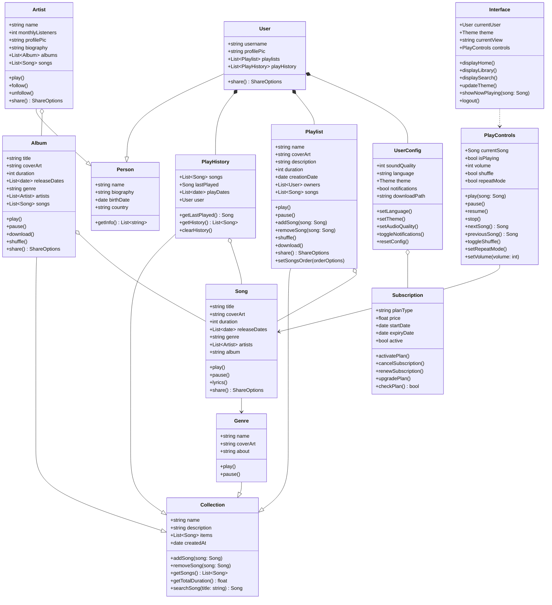
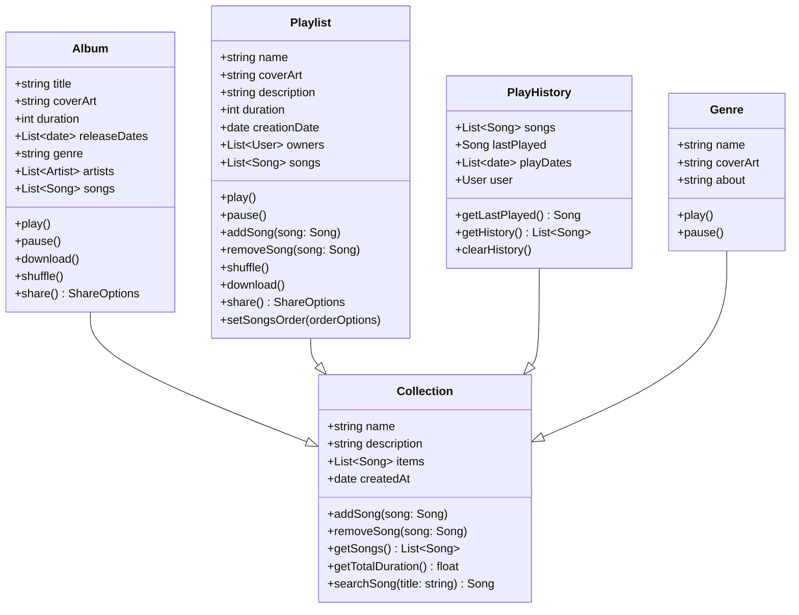
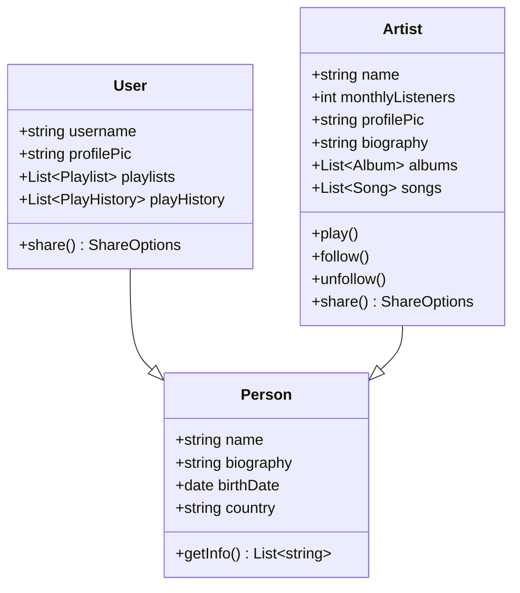

# Reto-2-
Diagrama tipo UML con todas las clases

```mermaid
classDiagram
class Song {
    +string title
    +string coverArt
    +int duration
    +List~date~ releaseDates
    +string genre
    +List~Artist~ artists
    +string album
    +play()
    +pause()
    +lyrics()
    +share() ShareOptions
}

class Album {
    +string title
    +string coverArt
    +int duration
    +List~date~ releaseDates
    +string genre
    +List~Artist~ artists
    +List~Song~ songs
    +play()
    +pause()
    +download()
    +shuffle()
    +share() ShareOptions
}

class Artist {
    +string name
    +int monthlyListeners
    +string profilePic
    +string biography
    +List~Album~ albums
    +List~Song~ songs
    +play()
    +follow()
    +unfollow()
    +share() ShareOptions
}

class Playlist {
    +string name
    +string coverArt
    +string description
    +int duration
    +date creationDate
    +List~User~ owners
    +List~Song~ songs
    +play()
    +pause()
    +addSong(song: Song)
    +removeSong(song: Song)
    +shuffle()
    +download()
    +share() ShareOptions
    +setSongsOrder(orderOptions)
}

class Genre {
    +string name
    +string coverArt
    +string about
    +play()
    +pause()
}

class User {
    +string username
    +string profilePic
    +List~Playlist~ playlists
    +List~PlayHistory~ playHistory
    +share() ShareOptions
}

class UserConfig {
    +int soundQuality
    +string language
    +Theme theme
    +bool notifications
    +string downloadPath
    +setLanguage()
    +setTheme()
    +setAudioQuality()
    +toggleNotifications()
    +resetConfig()
}

class Subscription {
    +string planType
    +float price
    +date startDate
    +date expiryDate
    +bool active
    +activatePlan()
    +cancelSubscription()
    +renewSubscription()
    +upgradePlan()
    +checkPlan() bool
}

class Interface {
    +User currentUser
    +Theme theme
    +string currentView
    +PlayControls controls
    +displayHome()
    +displayLibrary()
    +displaySearch()
    +updateTheme()
    +showNowPlaying(song: Song)
    +logout()
}

class PlayControls {
    +Song currentSong
    +bool isPlaying
    +int volume
    +bool shuffle
    +bool repeatMode
    +play(song: Song)
    +pause()
    +resume()
    +stop()
    +nextSong() Song
    +previousSong() Song
    +toggleShuffle()
    +setRepeatMode()
    +setVolume(volume: int)
}

class Person {
    +string name
    +string biography
    +date birthDate
    +string country
    +getInfo() List~string~
}

class Collection {
    +string name
    +string description
    +List~Song~ items
    +date createdAt
    +addSong(song: Song)
    +removeSong(song: Song)
    +getSongs() List~Song~
    +getTotalDuration() float
    +searchSong(title: string) Song
}

class PlayHistory {
    +List~Song~ songs
    +Song lastPlayed
    +List~date~ playDates
    +User user
    +getLastPlayed() Song
    +getHistory() List~Song~
    +clearHistory()
}
```
### Relacion General

```mermaid
classDiagram
direction TB
    class Song {
	    +string title
	    +string coverArt
	    +int duration
	    +List~date~ releaseDates
	    +string genre
	    +List~Artist~ artists
	    +string album
	    +play()
	    +pause()
	    +lyrics()
	    +share() ShareOptions
    }

    class Album {
	    +string title
	    +string coverArt
	    +int duration
	    +List~date~ releaseDates
	    +string genre
	    +List~Artist~ artists
	    +List~Song~ songs
	    +play()
	    +pause()
	    +download()
	    +shuffle()
	    +share() ShareOptions
    }

    class Playlist {
	    +string name
	    +string coverArt
	    +string description
	    +int duration
	    +date creationDate
	    +List~User~ owners
	    +List~Song~ songs
	    +play()
	    +pause()
	    +addSong(song: Song)
	    +removeSong(song: Song)
	    +shuffle()
	    +download()
	    +share() ShareOptions
	    +setSongsOrder(orderOptions)
    }

    class Genre {
	    +string name
	    +string coverArt
	    +string about
	    +play()
	    +pause()
    }

    class Artist {
	    +string name
	    +int monthlyListeners
	    +string profilePic
	    +string biography
	    +List~Album~ albums
	    +List~Song~ songs
	    +play()
	    +follow()
	    +unfollow()
	    +share() ShareOptions
    }

    class Collection {
	    +string name
	    +string description
	    +List~Song~ items
	    +date createdAt
	    +addSong(song: Song)
	    +removeSong(song: Song)
	    +getSongs() List~Song~
	    +getTotalDuration() float
	    +searchSong(title: string) Song
    }

    class Person {
	    +string name
	    +string biography
	    +date birthDate
	    +string country
	    +getInfo() List~string~
    }

    class User {
	    +string username
	    +string profilePic
	    +List~Playlist~ playlists
	    +List~PlayHistory~ playHistory
	    +share() ShareOptions
    }

    class UserConfig {
	    +int soundQuality
	    +string language
	    +Theme theme
	    +bool notifications
	    +string downloadPath
	    +setLanguage()
	    +setTheme()
	    +setAudioQuality()
	    +toggleNotifications()
	    +resetConfig()
    }

    class Subscription {
	    +string planType
	    +float price
	    +date startDate
	    +date expiryDate
	    +bool active
	    +activatePlan()
	    +cancelSubscription()
	    +renewSubscription()
	    +upgradePlan()
	    +checkPlan() bool
    }

    class PlayHistory {
	    +List~Song~ songs
	    +Song lastPlayed
	    +List~date~ playDates
	    +User user
	    +getLastPlayed() Song
	    +getHistory() List~Song~
	    +clearHistory()
    }

    class Interface {
	    +User currentUser
	    +Theme theme
	    +string currentView
	    +PlayControls controls
	    +displayHome()
	    +displayLibrary()
	    +displaySearch()
	    +updateTheme()
	    +showNowPlaying(song: Song)
	    +logout()
    }

    class PlayControls {
	    +Song currentSong
	    +bool isPlaying
	    +int volume
	    +bool shuffle
	    +bool repeatMode
	    +play(song: Song)
	    +pause()
	    +resume()
	    +stop()
	    +nextSong() Song
	    +previousSong() Song
	    +toggleShuffle()
	    +setRepeatMode()
	    +setVolume(volume: int)
    }

Album --|> Collection
Playlist --|> Collection
PlayHistory --|> Collection
Genre --|> Collection
User --|> Person
Artist --|> Person

User *-- PlayHistory
User *-- Playlist
User *-- UserConfig

UserConfig o-- Subscription
Playlist o-- Song
Album o-- Song
Artist o-- Album
PlayHistory o-- Song

Song --> Genre
PlayControls --> Song

Interface ..> PlayControls

```
### Relacion about collection-(Album, Playlist, Playhistory, Genre)

```mermaid
classDiagram
class Album {
    +string title
    +string coverArt
    +int duration
    +List~date~ releaseDates
    +string genre
    +List~Artist~ artists
    +List~Song~ songs
    +play()
    +pause()
    +download()
    +shuffle()
    +share() ShareOptions
}
class Playlist {
    +string name
    +string coverArt
    +string description
    +int duration
    +date creationDate
    +List~User~ owners
    +List~Song~ songs
    +play()
    +pause()
    +addSong(song: Song)
    +removeSong(song: Song)
    +shuffle()
    +download()
    +share() ShareOptions
    +setSongsOrder(orderOptions)
}
class Collection {
    +string name
    +string description
    +List~Song~ items
    +date createdAt
    +addSong(song: Song)
    +removeSong(song: Song)
    +getSongs() List~Song~
    +getTotalDuration() float
    +searchSong(title: string) Song
}

class PlayHistory {
    +List~Song~ songs
    +Song lastPlayed
    +List~date~ playDates
    +User user
    +getLastPlayed() Song
    +getHistory() List~Song~
    +clearHistory()
}
    class Genre {
	    +string name
	    +string coverArt
	    +string about
	    +play()
	    +pause()
    }
Album --|> Collection
Playlist --|> Collection
PlayHistory --|> Collection
Genre --|> Collection
```
### Relacion About Person-(User, Artist)

```mermaid
classDiagram
class User {
	    +string username
	    +string profilePic
	    +List~Playlist~ playlists
	    +List~PlayHistory~ playHistory
	    +share() ShareOptions
    }
class Person {
	    +string name
	    +string biography
	    +date birthDate
	    +string country
	    +getInfo() List~string~
    }
class Artist {
	    +string name
	    +int monthlyListeners
	    +string profilePic
	    +string biography
	    +List~Album~ albums
	    +List~Song~ songs
	    +play()
	    +follow()
	    +unfollow()
	    +share() ShareOptions
    }
User --|> Person
Artist --|> Person
```
